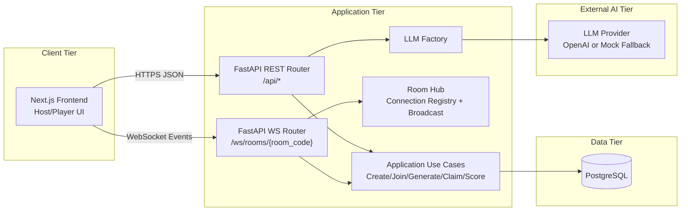
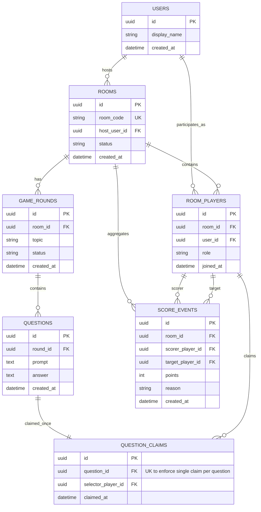
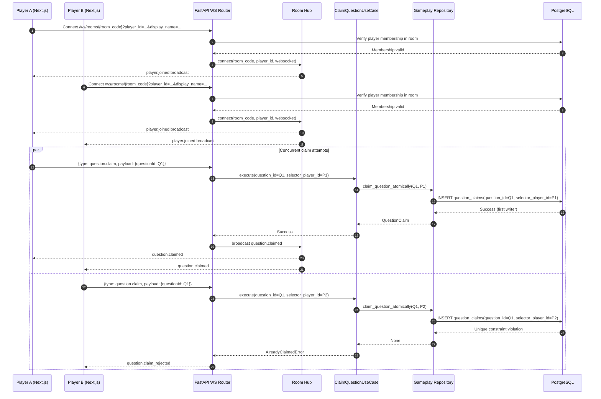

# 02 System Design

## 1. Document Purpose

This document defines the system design baseline for CS-Icebreaker Hub, including runtime architecture, persistence model, and critical real-time interaction sequencing.

## 2. Architectural Overview

The platform is a web-based real-time game system with four primary technical subsystems:

- Next.js frontend for host/player interfaces and WebSocket client behavior.
- FastAPI backend for REST APIs, WebSocket channels, orchestration, and domain use cases.
- PostgreSQL for authoritative game state and transactional invariants.
- LLM provider integration via factory-backed adapter abstraction.

### 2.1 System Architecture Diagram

## 3. Clean Architecture Layering

### 3.1 Presentation Layer

- REST endpoints for room, question, and health workflows.
- WebSocket endpoint for room-scoped, low-latency signaling.

### 3.2 Application Layer

- Use cases coordinate room lifecycle, question generation/listing, claim operations, and scoring behavior.

### 3.3 Domain Layer

- Core entities and repository contracts define invariant boundaries and business-level interaction rules.

### 3.4 Infrastructure Layer

- SQLAlchemy repositories provide persistence behavior.
- Alembic migrations provide schema evolution.
- LLM providers are selected through a factory to isolate external dependency behavior.

## 4. Persistence Model

The implementation uses SQLAlchemy models that map directly to PostgreSQL relations.
The schema emphasizes room-centric state, event chronology, and claim arbitration.

### 4.1 Database ERD

## 5. Critical Runtime Sequence

The most critical race-sensitive path is concurrent question claim handling over WebSocket.
The design delegates arbitration to a unique database constraint on `question_claims.question_id`.

### 5.1 Sequence Diagram: WS Connection + First-Come Claim

## 6. Concurrency and Consistency Strategy

- Race handling is resolved by a write-time unique constraint at persistence layer.
- Claim outcome is deterministic per question under concurrent pressure.
- Broadcast updates produce eventual room-wide visibility of accepted claims.

## 7. Design Risks and Forward Improvements

- WebSocket identity trust and room-bound claim validation require additional hardening.
- Event schema strictness should be tightened to prevent frontend/backend drift.
- Reconnection strategy and ordered refresh behavior should be formalized for resilient UX under network churn.

These items align with existing QA debt tracking and should be treated as high-priority reliability workstreams.
